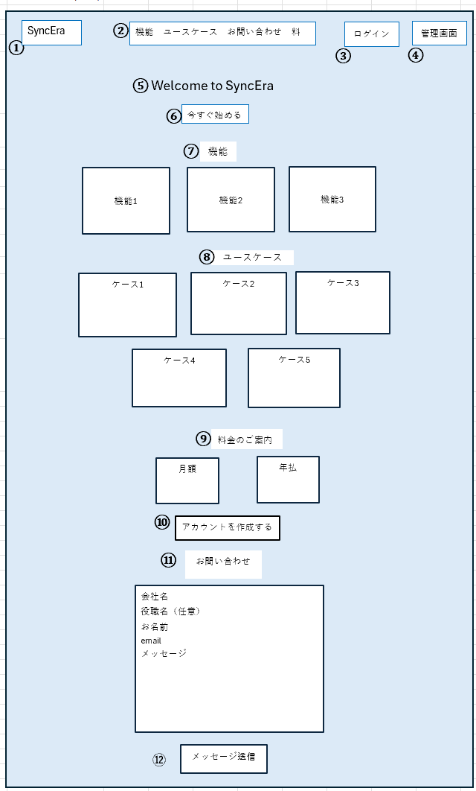
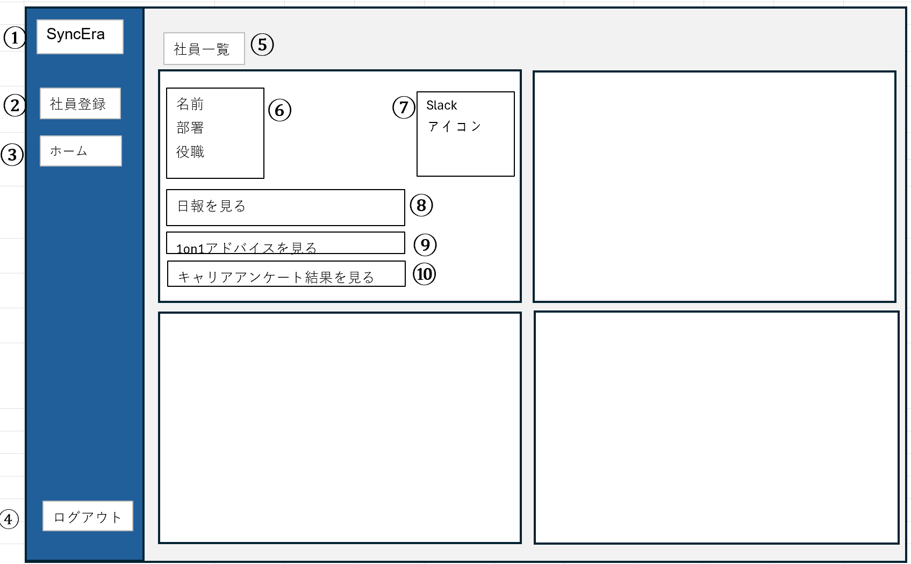
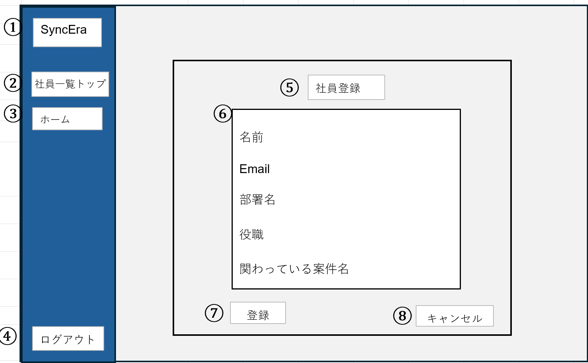
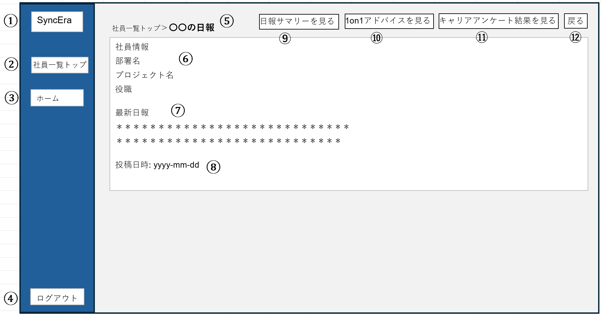
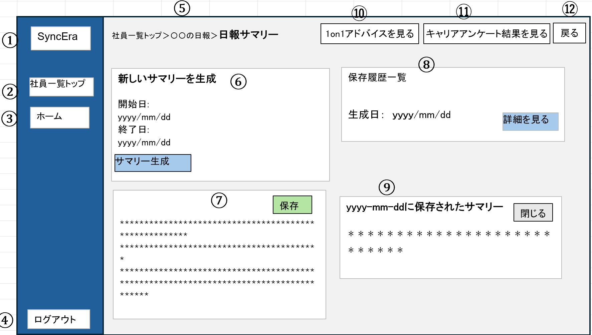
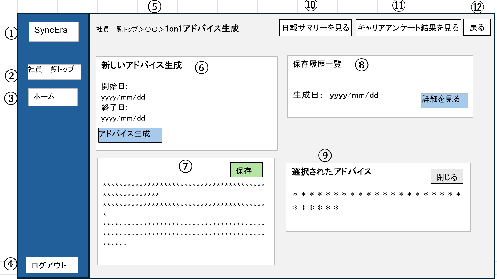
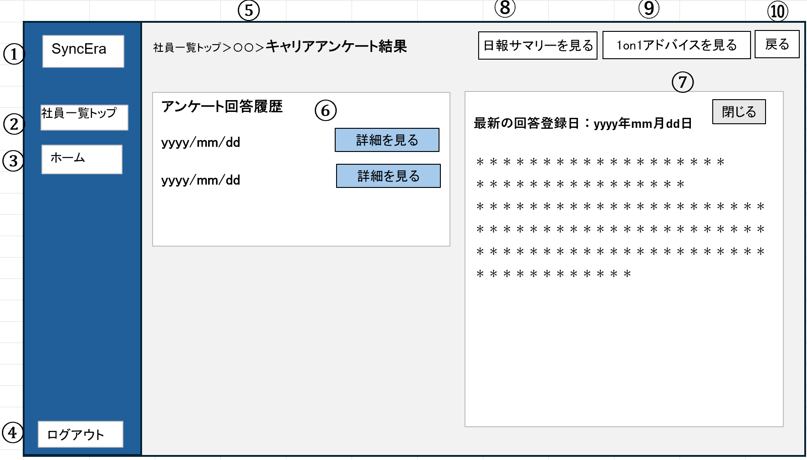

# SyncEra 画面仕様書(WF)

# ホーム画面

- 目的：ユーザーがサイトの主要なコンテンツや機能にアクセスできる入口となる画面
- 関連画面：ログイン、管理画面、アカウント作成画面、決済、社員一覧

## レイアウト図

| 番号 | 機能 | 詳細 | 挙動 | 遷移先画面 |
| --- | --- | --- | --- | --- |
| ① | ロゴ | | | |
| ② | グローバル ナビゲーション | グロナビ種類 ・機能 ・ユースケース ・料金 ・お問い合わせ | 各内容へ遷移する | ・機能 ・ユースケース  ・料金  ・お問い合わせ |
| ③ | ログイン | ユーザーはここからログインする | ログイン画面へ遷移する | ログイン画面 |
| ④ | 新規登録 | ユーザーの新規登録 | 新規登録画面へ遷移する | 新規登録画面 |
| ⑤ | Welcome to SyncEra | | | |
| ⑥ | 今すぐ始める | 新規登録と同じ機能 | 新規登録画面へ遷移する | 新規登録画面 |
| ⑦ | 機能紹介 | ３つの機能を紹介する | | |
| ⑧ | ユースケース紹介 | ５つのユースケースを紹介する | | |
| ⑨ | 料金プラン案内 | 月額と年払の料金プランを表示 | | |
| ⑩ | アカウント作成する | 企業（団体）の代表者が登録するフォーム | 登録フォームへ遷移する | 登録フォーム画面 |
| ⑪ | 問い合わせ | お問い合わせの内容ご記入後、メッセージが開発者へ送信される | 送信後、お礼のメッセージが表示される | お礼メッセージ画面 |
| ⑫ | メッセージ送信 | 問い合わせフォーム入力後、メッセージを送信する | メッセージ送信完了画面へ遷移 | メッセージ送信完了画面 |

# 社員一覧画面

- 目的：ユーザーが一目で社員の情報を確認できる。また登録された各社員の日報、1on1 アドバイス、キャリアアンケート結果の画面へ遷移が出来る。社員登録画面へも遷移できる。
- 関連画面：ホーム画面、社員登録画面、日報を見る、1on1 アドバイス画面、キャリアアンケート結果画面、ログアウト

## レイアウト図

| 番号 | 機能                   | 詳細                                                         | 挙動                                   | 遷移先画面             |
| ---- | ---------------------- | ------------------------------------------------------------ | -------------------------------------- | ---------------------- |
| ①    | ロゴ                   | ロゴを配置する。                                             |                                        |                        |
| ②    |                        | 社員情報を登録できる画面に遷移できるボタン。                 | 社員登録画面へ遷移する。               | 社員登録画面           |
| ③    | ホームページへ戻る     | ホーム画面に遷移するボタン                                   | ホーム画面へ遷移する。                 | ホーム画面　           |
| ④    | ログアウト             | ログアウトボタン。                                           | ログアウトし、ホーム画面へ遷移する。   | ホーム画面             |
| ⑤    | ページタイトル         | ページタイトル配置する。                                     |                                        |                        |
| ⑥    | 社員詳細               | 社員登録した情報（名前、部署、役職、担当案件名）を表示する。 |                                        |                        |
| ⑦    | Slack アイコン         | Slack で使用されているアイコンを表示する。                   |                                        |                        |
| ⑧    | 社員日報を見る         | 社員日報画面に遷移するボタン。                               | 選択した社員の日報画面へ遷移する。     | 社員日報画面           |
| ⑨    | 1on1 アドバイス        | 1on1 アドバイス画面に遷移するボタン。                        | 1on1 アドバイス画面へ遷移する。        | 1on1 アドバイス画面　  |
| ⑩    | キャリアアンケート結果 | キャリアアンケート結果画面に遷移するボタン。                 | キャリアアンケート結果画面へ遷移する。 | キャリアアンケート画面 |

# 社員登録画面

- 目的：ユーザーが新たな社員を登録し、その社員に関する基本情報をデータベースに保存する。この画面では、社員の個人情報や職務に関連する情報を入力し、関連システムと連携させるためのデータを提供します。
- 関連画面：ホーム画面、社員一覧画面

## レイアウト図

| **番号** | **機能**           | **詳細**                                                                                                                                                                                                                                                            | **挙動**                                                                                                                                                         | **遷移ページ番号** |
| -------- | ------------------ | ------------------------------------------------------------------------------------------------------------------------------------------------------------------------------------------------------------------------------------------------------------------- | ---------------------------------------------------------------------------------------------------------------------------------------------------------------- | ------------------ |
| ①        | ロゴ               | ロゴを配置する                                                                                                                                                                                                                                                      |                                                                                                                                                                  |                    |
| ②        | 社員一覧へ戻る     | 社員一覧画面へ遷移するボタン                                                                                                                                                                                                                                        | 社員一覧画面へ遷移する                                                                                                                                           | 社員一覧画面　     |
| ③        | ホームページへ戻る | ホーム画面に遷移するボタン                                                                                                                                                                                                                                          | ホーム画面へ遷移する                                                                                                                                             | ホーム画面         |
| ④        | ログアウト         | ログアウトボタン                                                                                                                                                                                                                                                    | ログアウトする                                                                                                                                                   | ホーム画面         |
| ⑤        | ページタイトル     | ページタイトル配置                                                                                                                                                                                                                                                  |                                                                                                                                                                  |                    |
| ⑥        | 社員登録フォーム   | 名前: 社員の名前を入力するフィールド。 Email: 社員のメールアドレスを入力するフィールド。 部署名: 社員が所属する部署を入力するフィールド。 役職: 社員の役職を入力するフィールド。 関わっている案件名: 社員が担当しているプロジェクト名を入力するフィール |                                                                                                                                                                  |                    |
| ⑦        | 登録ボタン         | 社員情報を入力後、登録ボタンをクリックし、登録する。                                                                                                                                                                                                                | 「登録」ボタンをクリックすると、フォームに入力されたデータが、社員一覧ページにリダイレクトされる。                                                               |                    |
| ⑧        | キャンセルボタン   | 社員登録をキャンセルするためのボタン。                                                                                                                                                                                                                              | 「キャンセル」ボタンをクリックすると、すべてのフォームがクリアされ、アイコンのプレビューもリセットされます。これにより、ユーザーは入力内容をすべて初期化できる。 |                    |

# 日報画面

- 目的：社員が日々の業務内容や進捗状況を報告し、これをユーザー（上司、リーダー）が確認・管理できるようにすることです。この画面を通じて、社員の作業状況を可視化し、業務の効率化やコミュニケーションの向上を図ります。
- 関連画面：ホーム画面、社員一覧画面、日報サマリー画面

## レイアウト図

| **番号** | **機能**                     | **詳細**                                                                                                                 | **挙動**                                                     | **遷移先画面**             |
| -------- | ---------------------------- | ------------------------------------------------------------------------------------------------------------------------ | ------------------------------------------------------------ | -------------------------- |
| ①        | ロゴ                         | ロゴを配置する                                                                                                           |                                                              |                            |
| ②        | 社員一覧トップ               | 社員一覧画面へ遷移するボタン                                                                                             | 社員一覧画面へ遷移する                                       | 社員一覧画面               |
| ③        | ホーム                       | ホーム画面に遷移するボタン                                                                                               | ホーム画面へ遷移する                                         | ホーム画面                 |
| ④        | ログアウト                   | ログアウトボタン                                                                                                         | ログアウトする                                               | ホーム画面                 |
| ⑤        | ページタイトル               | 階層型ナビゲーション 現在のページがトップにあり（〇〇の日報）、前の階層に戻ることが出来る。                              | 「社員一覧トップ」をクリックすると「社員一覧」画面に遷移する | 社員一覧画面               |
| ⑥        | 社員情報                     | 社員名、部署、プロジェクト名、役職が表示される。                                                                         |                                                              |                            |
| ⑦        | 日報セクション               | 社員が最後に提出した日報の内容を表示します。日報のテキスト内容が表示され、その下に日報の提出日時が記載される。           |                                                              |                            |
| ⑧        | 投稿日時                     | 日報を投稿した日時を表示                                                                                                 |                                                              |                            |
| ⑨        | 日報サマリーを見る           | 「日報サマリーを見る」ボタンをクリックすると、該当社員の過去の日報をまとめて確認できる「日報サマリー」画面に遷移される。 | 選択した社員の日報サマリー画面へ遷移する                     | 社員日報サマリー画面       |
| ⑩        | 1on1 アドバイスを見る        | 「1on1 アドバイスを見る」ボタンをクリックすると該当社員の「1on1 アドバイス生成」画面へ遷移される。                       | 日報画面から 1on1 アドバイス生成画面へ遷移する               | 1on1 アドバイス生成画面    |
| ⑪        | キャリアアンケート結果を見る | 「キャリアアンケート結果を見る」ボタンをクリックすると該当社員の「キャリアアンケート結果画面」へ遷移される。             | 日報画面からキャリアアンケート結果画面へ遷移する。           | キャリアアンケート結果画面 |
| ⑫        | 戻る                         | 「戻る」をクリックすると社員一覧画面へ遷移する。                                                                         | 日報画面から社員一覧画面へ遷移する                           | 社員一覧画面               |

# 日報サマリー画面

- **目的**：社員が提出した過去の日報を要約し、確認、保存ができる。この画面は、社員の業務内容や進捗状況を時系列で把握したり、特定の期間における業務の傾向を分析したりするために利用されます。
- **関連画面**：社員一覧画面、日報画面、ホーム画面、1on1 アドバイス画面、キャリアアンケート結果画面

## レイアウト図

| 番号 | 機能                            | 詳細                                                                                                                                                           | 挙動                                                                                                                     | 遷移先画面                  |
| ---- | ------------------------------- | -------------------------------------------------------------------------------------------------------------------------------------------------------------- | ------------------------------------------------------------------------------------------------------------------------ | --------------------------- |
| ①    | ロゴ                            | ロゴを配置する。                                                                                                                                               |                                                                                                                          |                             |
| ②    | 社員一覧トップ                  | 社員一覧画面へ遷移するボタン                                                                                                                                   | 社員一覧画面へ遷移する                                                                                                   | 社員一覧画面                |
| ③    | ホーム                          | ホーム画面に遷移するボタン                                                                                                                                     | 日報サマリー画面からホーム画面へ遷移する                                                                                 | ホーム画面                  |
| ④    | ログアウト                      | ログアウトボタン                                                                                                                                               | ログアウトする                                                                                                           | ホーム画面                  |
| ⑤    | ページタイトル                  | 階層型ナビゲーション トップに現在の画面（日報サマリー）が表示されている。その前の画面が〇〇の日報画面になり、さらにその前は社員一覧トップ画面になる。          | 前の画面（〇〇の日報）をクリックするとそのページへ遷移する。また「社員一覧トップ」をクリックすると社員一覧画面へ遷移する | 〇〇の日報画面 社員一覧画面 |
| ⑥    | 新しいサマリーを生成            | 開始日を選び、終了日を選び「サマリー生成」ボタンをクリックするとその期間に記載した日報のサマリーが生成され、下に表示される。                                   | 開始日の選定ボタンと終了日選定ボタン、でサマリーしてほしい期間を選んだあと、「サマリー生成」ボタンをクリックする。       |                             |
| ⑦    | 生成された日報サマリー          | 上記で生成された日報サマリーが表示される。右上に「保存」ボタンがあり、「保存」をクリックすると右側の「保存履歴一覧」に表示される。                             | 「保存」ボタンを押すと、右側に履歴が記録される。                                                                         |                             |
| ⑧    | 保存履歴一覧                    | 保存された日報サマリーが履歴として記録される。生成日（yyyy/mm/dd）の横に「詳細を見る」ボタンがあり、それをクリックすると、保存されたサマリーが下に表示される。 | 「詳細を見る」をクリックすると下に保存された日報サマリーが表示される。                                                   |                             |
| ⑨    | yyyy-mm-dd に保存されたサマリー | 保存されたサマリーを確認し「閉じる」ボタンで、表示を消せる。                                                                                                   | 「閉じる」ボタンで表示を消す。                                                                                           |                             |
| ⑩    | 1on1 アドバイスを見る           | 「1on1 アドバイスを見る」ボタンをクリックすると該当社員の「1on1 アドバイス生成」画面へ遷移される。                                                             | 日報サマリー画面から 1on1 アドバイス生成画面へ遷移する                                                                   | 1on1 アドバイス生成画面     |
| ⑪    | キャリアアンケート結果を見る    | 「キャリアアンケート結果を見る」ボタンをクリックすると該当社員の「キャリアアンケート結果画面」へ遷移される。                                                   | 日報サマリー画面からキャリアアンケート結果画面へ遷移する。                                                               | キャリアアンケート結果画面  |
| ⑫    | 戻る                            | 「戻る」をクリックすると社員一覧画面へ遷移する。                                                                                                               | 日報サマリー画面から〇〇の日報画面へ遷移する                                                                             | 〇〇の日報画面              |

# 1on1 アドバイス画面

- 目的：1on1 アドバイスの画面は、効果的なコミュニケーションとフィードバックの記録・共有を支援し、目標設定、パフォーマンスの向上、エンゲージメントの向上を目的としています。このような画面を提供することで、上司と部下、あるいはメンターとメンティーの関係性を強化し、組織全体の成長を促進することができます。
- 関連画面：社員一覧画面、日報画面、ホーム画面、日報サマリー、キャリアアンケート結果画面

## レイアウト図

| 番号 | 機能                              | 詳細                                                                                                                                                             | 挙動                                                                                                                     | 遷移先画面                     |
| ---- | --------------------------------- | ---------------------------------------------------------------------------------------------------------------------------------------------------------------- | ------------------------------------------------------------------------------------------------------------------------ | ------------------------------ |
| ①    | ロゴ                              | ロゴを配置する。                                                                                                                                                 |                                                                                                                          |                                |
| ②    | 社員一覧トップ                    | 社員一覧画面へ遷移するボタン                                                                                                                                     | 社員一覧画面へ遷移する                                                                                                   | 社員一覧画面                   |
| ③    | ホーム                            | ホーム画面に遷移するボタン                                                                                                                                       | 1on1 アドバイス画面からホーム画面へ遷移する                                                                              | ホーム画面                     |
| ④    | ログアウト                        | ログアウトボタン                                                                                                                                                 | ログアウトする                                                                                                           | ホーム画面                     |
| ⑤    | ページタイトル                    | 階層型ナビゲーション  トップに現在の画面（1on1 アドバイス生成）が表示されている。その前の画面が〇〇の日報画面になり、さらにその前は社員一覧トップ画面になる。 | 前の画面（〇〇の日報）をクリックするとそのページへ遷移する。また「社員一覧トップ」をクリックすると社員一覧画面へ遷移する | 〇〇の日報画面 社員一覧画面 |
| ⑥    | 新しいアドバイスを生成            | 開始日を選び、終了日を選び「アドバイス生成」ボタンをクリックするとその期間に記載した 1on1 アドバイスが生成され、下に表示される。                                 | 開始日の選定ボタンと終了日選定ボタンでアドバイスに必要な期間を選んだあと、「サマリー生成」ボタンをクリックする。         |                                |
| ⑦    | 生成された 1on1 アドバイス        | 上記で生成されたアドバイスが表示される。右上に「保存」ボタンがあり、「保存」をクリックすると右側の「保存履歴一覧」に表示される。                                 | 「保存」ボタンを押すと、右側に履歴が記録される。                                                                         |                                |
| ⑧    | 保存履歴一覧                      | 保存されたアドバイスが履歴として記録される。生成日（yyyy/mm/dd）の横に「詳細を見る」ボタンがあり、それをクリックすると、保存されたアドバイスが下に表示される。   | 「詳細を見る」をクリックすると下に保存されたアドバイスが表示される。                                                     |                                |
| ⑨    | yyyy-mm-dd に保存されたアドバイス | 保存されたアドバイスを確認し「閉じる」ボタンで、表示を消せる。                                                                                                   | 「閉じる」ボタンで表示を消す。                                                                                           |                                |
| ⑩    | 日報サマリーを見る                | 「日報サマリーを見る」ボタンをクリックすると該当社員の「日報サマリー」画面へ遷移される。                                                                         | 1on1 アドバイス生成画面から日報サマリー画面へ遷移する                                                                    | 日報サマリー画面               |
| ⑪    | キャリアアンケート結果を見る      | 「キャリアアンケート結果を見る」ボタンをクリックすると該当社員の「キャリアアンケート結果画面」へ遷移される。                                                     | 1on1 アドバイス画面からキャリアアンケート結果画面へ遷移する。                                                            | キャリアアンケート結果画面     |
| ⑫    | 戻る                              | 「戻る」をクリックすると社員一覧画面へ遷移する。                                                                                                                 | 1on1 アドバイス画面から〇〇の日報へ遷移する                                                                              | 〇〇の日報画面                 |

# キャリアアンケート結果画面

- 目的：キャリアアンケート結果画面は、個人のキャリア開発支援、組織の人材戦略強化、エンゲージメント向上、データに基づく意思決定支援など、多岐にわたります。結果画面は見やすく理解しやすいデザインで、フィードバックや次のアクションにつながる具体的な情報を提供します。
- 関連画面：社員一覧画面、日報画面、ホーム画面、日報サマリー、1on1 アドバイス画面

## レイアウト図

| 番号 | 機能                  | 詳細                                                                                                                                                           | 挙動                                                                                                                     | 遷移先画面                 |
| ---- | --------------------- | -------------------------------------------------------------------------------------------------------------------------------------------------------------- | ------------------------------------------------------------------------------------------------------------------------ | -------------------------- |
| ①    | ロゴ                  | ロゴを配置する。                                                                                                                                               |                                                                                                                          |                            |
| ②    | 社員一覧トップ        | 社員一覧画面へ遷移するボタン                                                                                                                                   | 社員一覧画面へ遷移する                                                                                                   | 社員一覧画面               |
| ③    | ホーム                | ホーム画面に遷移するボタン                                                                                                                                     | 1on1 アドバイス画面からホーム画面へ遷移する                                                                              | ホーム画面                 |
| ④    | ログアウト            | ログアウトボタン                                                                                                                                               | ログアウトする                                                                                                           | ホーム画面                 |
| ⑤    | ページタイトル        | 階層型ナビゲーショントップに現在の画面（キャリアアンケート結果）が表示されている。その前の画面が〇〇の日報画面になり、さらにその前は社員一覧トップ画面になる。 | 前の画面（〇〇の日報）をクリックするとそのページへ遷移する。また「社員一覧トップ」をクリックすると社員一覧画面へ遷移する | 〇〇の日報画面社員一覧画面 |
| ⑥    | アンケート回答履歴    | Slack で回答したアンケートが履歴が表示される                                                                                                                   | 「詳細を見る」ボタンをクリックすると、右側にアンケート回答の要約、および AI による考察が表示される。                     |                            |
| ⑦    | アンケート結果表示    | 左側で選択された日付の「詳細を見る」ボタンをクリックするとアンケート結果が表示される。                                                                         | 表示されたアンケート結果を「閉じる」ボタンで非表示できる。                                                               |                            |
| ⑧    | 日報サマリーを見る    | 「日報サマリーを見る」ボタンをクリックすると該当社員の「日報サマリー」画面へ遷移される。                                                                       | 1on1 アドバイス生成画面から日報サマリー画面へ遷移する                                                                    | 日報サマリー画面           |
| ⑨    | 1on1 アドバイスを見る | 「1on1 アドバイスを見る」ボタンをクリックすると該当社員の「1on1 アドバイス生成」画面へ遷移される。                                                             | 日報サマリー画面から 1on1 アドバイス生成画面へ遷移する                                                                   | 1on1 アドバイス生成画面    |
| ⑩    | 戻る                  | 「戻る」をクリックすると社員一覧画面へ遷移する。                                                                                                               | 日報サマリー画面から〇〇の日報画面へ遷移する                                                                             | 〇〇の日報画面             |

##
